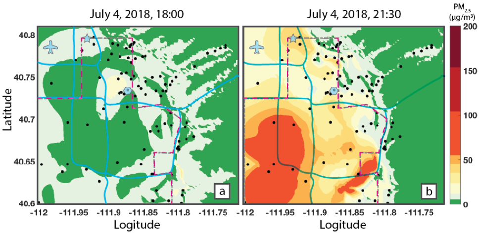

*Estimated PM2.5 concentration at 6:00 pm (left panel) and 9:30 pm (right panel) on July 4, 2018. The dotted line indicates the area where fireworks are prohibited.*

## Project information

CPS: Synergy: A Layered Framework of Sensors, Models, Land-Use Information and Citizens for Understanding Air Quality in Urban Environments"

Award 1646408

## Synopsis

A low-cost, efficient pollution monitoring embedded system is currently under design by the electrical engineering team. The goal is a device that does not significantly sacrifice accuracy of PM concentration measurement for a small, low-cost, low-power footprint. Each station is fully self-contained, and is capable of relaying data about its environment to a cloud storage at an arbitrarily rapid rate. The stations will be distributed across Salt Lake City through a citizen science engagement effort.
The computer science team will stream the measurements into a statistical modeling system to estimate PM levels across Salt Lake City. This system will combine sensor measurements with land-use information to produce accurate, real-time estimates and fine-grained resolutions. The estimates will be communicated to the public through a web-based visualization interface. This interface will include advanced functionality to support individualized sense-making of PM exposures.

The combined system will be a reliable and scalable cyber-physical framework for estimating air quality at a fine-grain in both space and time, coupled with fundamental breakthroughs in low-cost sensing, reliable modeling of environmental factors, and communication of air quality to the public. The proposed system should demonstrate the following:
1. flexible, general, integrated approach to acquiring PM measurements with varying degrees of density/accuracy/reliability,
2. incorporating land use, topographic data, and weather data, with sensor measurements
3. estimates of air quality with relatively high resolution in space and time,
4. validated with quantifiable estimates of expected error,
5. reasonable expectations of privacy for citizen- based monitoring stations, and
6. a responsive visualization-based API that can communicate estimates of PM levels and error estimates for any point in the Salt Lake Valley over a defined historical period.

## Personnel

- Miriah Meyer, PD/PI
- Pierre-Emmanuel Gaillardon,  Co PD/PI
- Kerry Kelly, Co PD/PI
- Ross Whitaker, Co PD/PI
- Pascal Goffin, Postdoctoral (scholar, fellow or other postdoctoral position)
- Tom Becnel, Graduate Student (research assistant)
- Amir Biglari, Graduate Student (research assistant)
- Tofigh Sahay, Graduate Student (research assistant)
- Aspen Hopkins, Undergraduate Student
- Trenton Taylor, Undergraduate Student
- Kyle Tingey, Undergraduate Student
- Matt Dailey, Undergraduate Student

## Collaborators

- Tony Butterfield

## Publications

### Journals or Juried Conference Papers

- K. Le, K. Tingey, T. Becnel, P. Giallardon, T. Butterfield/K. Kelly Building Air Quality Sensors & Citizen Scientists, Chemical Engineering Education. Proc. ASEE Annual Meeting, June 23 – 27, Salt Lake City, UT. Status = ACCEPTED.

### Other Conference Presentations / Papers
- P. Goffin, A. Hopkins, W. Willett, M Meyer. Challenges in Urban Air Quality Data Visualization. Proceedings of the IEEE VIS Workshop on Urban Data Visualization (CityVis).  Status = ACCEPTED
- K. Kelly, T. Sayahi, A. Petty, A. Butterfield (2017). Evaluation of the Plantower PMS Low-Cost Particulate Matter Sensor. Air Quality: Science for Solutions. Salt Lake City, UT. Status = PUBLISHED
- T. Sahay, T. Butterfield, K. Kelly (2017). Laboratory and Field Calibration of a Low-Cost Particulate Matter Sensor. AAAR Annual Meeting. Raleigh, NC. Status = PUBLISHED
- Aspen Hopkins, Pascal Goffin, Miriah Meyer (2017). Particulates Matter: Assessing Needs for Air Quality Visualization. IEEE VIS. Status = PUBLISHED

## Code + Websites

- Frontend: [Repository](https://github.com/visdesignlab/aqandu)
- Modeling: [Repository](https://github.com/pgoffin/AirU-website)
- Backend: [Repository](https://github.com/pgoffin/aqandu_cade_api)
- AirU Hardware and Firmware: [Repository](https://github.com/LNIS-Projects/AirU)

- AQ&U Citizen Website: [Website](https://aqandu.org)
- Public Air Quality Data API: [Website](https://air.eng.utah.edu/dbapi/api/dashboard)

## Educational activities

The Chemical Engineering team’s portion of the project has supported one graduate student who has been responsible for the design of the calibration system and sensor calibration and two undergraduate students. One student assisted with the firmware development and one student assisted with sensor deployment. We also partnered with a Mechanical Engineering senior design team to improve the sensor housing design. This Mechanical Engineering team’s work was highlighted at the American Society of Engineering Educators Annual Meeting. One Chemical Engineering senior design team developed a mount to install the AirU sensor on a drone, and performed proof-of-concept testing of the sensor on the drone. Several high-school students from a local science charter school (the Academy of Math Engineering and Science) have assisted with sensor calibration.

Over the course of the project, AirU’s electrical engineering team has solicited the help of several undergraduate students at the University of Utah to help progress the project through various conduits. We currently have an undergraduate student designing a smartphone app that will connect the AirU device to the host’s personal WiFi network. We felt this aligned well with the project because connecting headless IoT embedded devices (AKA the AirU devices) to WiFi networks is not always an intuitive process, and web browsers alone lack the hardware access necessary to automatically troubleshoot and resolve network connection issues. Designing an app makes a very thorough senior project for an undergraduate student, and gives the AirU team a higher standing with the Salt Lake community. We also have another student working with us for his senior project, with the intent to redesign the Gen 2 devices and significantly reduce the price-point of production and fabrication. This project covers a wide range of engineering disciplines, from PCB design to software development. We aim at reducing the cost of production from $250 to $75 through this project.

The computer science team includes a post-doc, graduate student, and female undergraduate who collaborate on the development of the modeling, data storage, and visualization systems. The undergraduate presented the results of her research on this project at the premier visualization conference in October, and the post-doc and graduate student presented the project at a local air quality conference in both a poster and oral presentation. A master’s student, Amir Biglari, completed his project-based MS degree as part of this project.

The project also featured prominently in two summer camps, and this work was performed in partnership with NSF 1642513. First, we engaged HiGear campers with a sensor maker kit. They built maker kits that include the same PM sensor as used by our project, and they tested their performance with several different types of particle pollution. HiGear campers are female high-school students who are interested in STEM. Second, ACCESS summer campers deployed a set of 8 of our project’s sensors over a two-week period during summer. They collected data and were able to view increases in PM over the 4th of July and during a wildfire event. ACCESS summer campers are highly promising female incoming freshmen who are interested in STEM. These ACCESS students spoke on a local radio show about their work with our project’s sensors.

## Outreach

National efforts to disseminate the results included invited talks at US Ignite and MPSoC, and presentations at the annual meetings of AAAR, INEF, Utah Science for Solutions, Annual Utah Air Quality Conference, U.S. Ignite, Utah Ignite, ASEE, Colorado State University. We also presented internationally at City, University of London. The output of the modeling system is both available online and in the form of animations that are used regularly by the team to present these results to broader audiences.

The team continues to actively perform community outreach, with an emphasis on engaging under-served areas. The local outreach venues included several community council meetings, a TechTalk at the city library, several media interviews, two community events at libraries in underserved communities, and an invited talk at the Utah Council of Engineers. These outreach activities have led to many more host volunteers than the project can support. However, it does allow us to have a rich set of choices for placing sensors in regions where the uncertainty is the highest.

## Broader impact outcomes

The work realized for the Gen2 board advances the field of low-cost air quality monitoring by creating an affordable system. It is the first time a versatile system (supporting all important measurements targeted by the project but also more through extension ports) is realized. The project is also gathering an unprecedented amount particulate matter concentration information that will enable us to understand low-cost sensor performance as well as to understand spatiotemporal patterns in particulate matter pollution. Furthermore, the project is identifying new ways that residents would like to engage with air quality data, leading to novel visualization design ideas.

The Gen2 system has already received a lot of attention through local outreach communities and asthma study communities. A start-up company, Tetrad: Sensor Network Solutions, LLC, has been created with the objective to fulfill the AirU sensors to local communities and research groups. Tetrad has deployed 150 devices in homes around the valley through the PRISMS research group—a asthma study group. 10 AirU devices have been sold to a professor at Utah State University, who has used them for air quality studies in Palestine, as well as the Logan valley.

Our preliminary results suggest that air quality is generally poorer in under-served communities in the Salt Lake Valley, and this information is critical as the state plans to place two new projects in this area, a new prison and an inland port. This type of baseline information will be extremely useful for policy makers as they attempt to understand and address air quality impacts from these projects.

The space/time models provide visualizations that allow broader audiences to appreciate the behavior of air-quality in the air shed. Events such as fireworks (on holidays), inversions, or wildfires have spatiotemporal patterns that can be better understood when seeing the evolving estimates of PM concentrations (and associated uncertainties). This understanding is impacting the broader discussion about air quality both in terms of individual behavior and policies that affect air quality in the Salt Lake Valley. The created system has broad impact on disciplines related to air quality studies as the system can be used to gather a large number of data at real-time and at low-cost.

